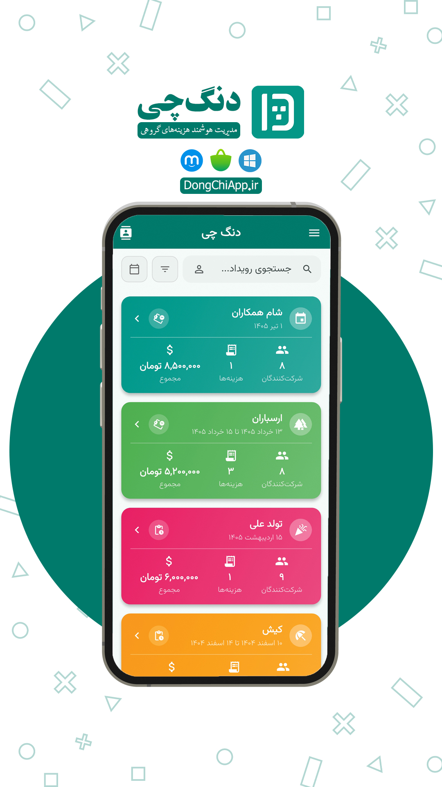

# دنگ چی | Dongchi

**اپلیکیشن مدیریت هزینه‌های گروهی**

---

**Dongchi** — A cross-platform Flutter app for splitting expenses and settling debts in groups

---

## درباره دنگ چی

**دنگ چی** یک اپلیکیشن کراس‌پلتفرم با فریمورک Flutter برای مدیریت هزینه‌های گروهی و تسویه بدهی‌هاست. با این اپلیکیشن می‌توانید رویدادهای مختلف (سفر، مهمانی، دورهمی و ...) بسازید، هزینه‌ها را ثبت کنید و در نهایت ببینید چه کسی به چه کسی بدهکار است.

## دانلود و نصب

| پلتفرم | لینک دانلود |
|---------|-------------|
| **اندروید (APK)** | [دانلود مستقیم](https://dl.dongchiapp.ir/) |
| **بازار** | [CafeBazaar](https://cafebazaar.ir/app/com.takbaran.dangchi) |
| **مایکت** | [Myket](https://myket.ir/app/com.takbaran.dangchi) |
| **وب (PWA)** | [dongchiapp.ir](https://dongchiapp.ir) |
| **ویندوز** | [GitHub Releases](https://github.com/fuladpanje/Dongchi/releases) |

---

## امکانات اصلی

### 🔹 مدیریت رویدادها
- ایجاد رویدادهای مختلف (سفر، مهمانی، رستوران، ورزش و ...)
- نمادهای از پیش تعریف شده و امکان انتخاب رنگ دلخواه
- جستجو و فیلتر رویدادها بر اساس نام، شرکت‌کننده و تاریخ شمسی

### 🔹 ثبت هزینه‌ها با تقسیم انعطاف‌پذیر
- **تقسیم مساوی** — بین تمام شرکت‌کنندگان
- **درصدی** — تعیین درصد هر نفر
- **سهمی** — تقسیم بر اساس نسبت
- **مبلغی** — تعیین مبلغ مشخص برای هر نفر
- امکان افزودن عکس رسید به هزینه

### 🔹 مدیریت شرکت‌کنندگان
- افزودن شرکت‌کننده با نام و شماره کارت بانکی (اختیاری)
- حذف گروهی شرکت‌کنندگان
- آمار تراکنش‌ها و مبلغ پرداختی هر نفر

### 🔹 الگوریتم تسویه هوشمند
- محاسبه خودکار بدهی‌ها با کمترین تعداد تراکنش
- نمایش وضعیت تسویه (پرداخت شده / در انتظار)
- نمایش شماره کارت بانکی برای انتقال آسان
- کپی شماره کارت با یک لمس

### 🔹 نمودارها و تحلیل‌ها
- نمودار دایره‌ای (سهم پرداخت هر نفر)
- نمودار میله‌ای (مانده حساب)
- نمایش وضعیت تسویه
- امکان اشتراک‌گذاری نمودارها به صورت تصویر

### 🔹 گزارش و PDF
- تولید گزارش PDF از تسویه‌ها
- چاپ و اشتراک‌گذاری اسناد PDF
- اشتراک‌گذاری متنی گزارش‌ها

### 🔹 سیستم مخاطبین
- دفترچه مخاطبین سراسری (جدا از شرکت‌کنندگان رویداد)
- ذخیره نام و شماره کارت بانکی
- جستجو بر اساس نام یا شماره کارت

### 🔹 پشتیبان‌گیری و بازیابی
- پشتیبان‌گیری کامل JSON با نسخه‌بندی
- دو حالت بازیابی: **ادغام** یا **جایگزینی**
- پشتیبان‌گیری خودکار ایمن قبل از بازیابی
- امکان اشتراک‌گذاری فایل پشتیبان

### 🔹 تنظیمات
- حالت تاریک / روشن
- واحد پرز: تومان یا ریال (تبدیل خودکار)
- حالت پنهان کردن مبالغ (حریم خصوصی)
- پاک کردن تمام داده‌ها

### 🔹 پشتیبانی کامل فارسی
- پشتیبانی RTL (راست به چپ)
- تقویم شمسی در تمام بخش‌ها
- تبدیل خودکار اعداد به فارسی (۰-۹)
- فونت وزیرمتن

---

## توسعه‌دهنده

**رضا فولادپانجه** — [fuladpanjeh.ir](https://fuladpanjeh.ir)

---

## ارتباط با ما

- وبسایت: [dongchiapp.ir](https://dongchiapp.ir)
- ایمیل: fuladpanje@gmail.com
